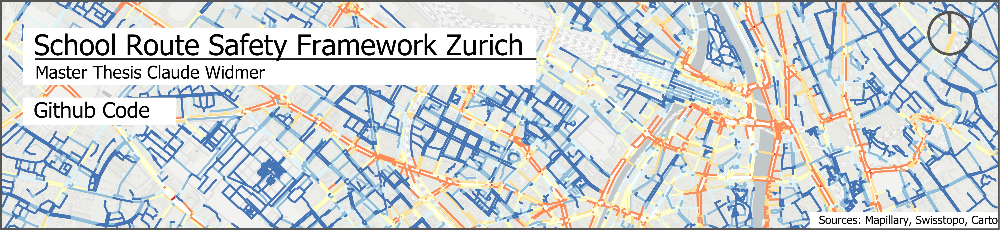
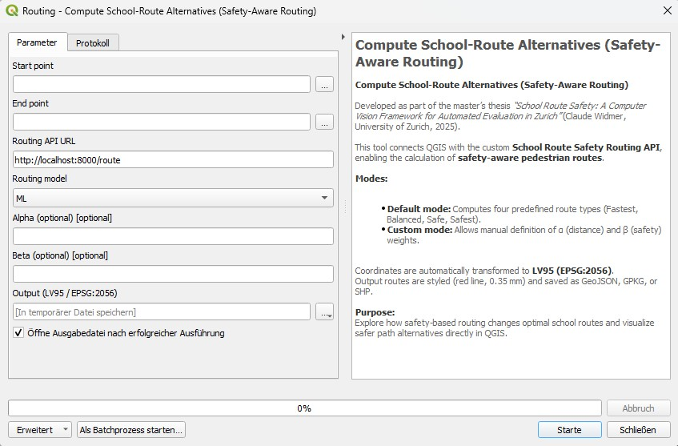

This repository contains the full computational framework developed for the master’s thesis  
**_“School Route Safety: A Computer Vision Framework for Automated Evaluation in Zurich”_**  
by **Claude Widmer**, University of Zurich (GIUZ), 2025.

The project combines computer vision, geospatial analysis, and routing methods to automatically evaluate school-route safety in Zurich. It includes (1) a modular Python pipeline for data processing and analysis, and (2) a FastAPI-based routing interface for visualisation and interaction in QGIS.

---

## 1. Project Overview

| Component | Description |
|------------|-------------|
| `API/` | FastAPI-based routing backend and Docker setup. |
| `Python_Code/` | All Jupyter notebooks and scripts for data processing, model training, and classification (Phases 1–3). |
| `docs/` | Documentation and example screenshots. |
| `API/data/` | Network file |

---

## 2. Python Pipeline (Phases 1–3)

The analytical framework is implemented in Python and divided into three main phases, following the structure of the thesis methodology.

### Phase 1 – Pedestrian Network Modelling  
**Folder:** `Python_Code/Phase 1`  
**Notebook:** `1_Model_Foot_Network.ipynb`

- Builds a routable pedestrian network from OpenStreetMap and municipal data.  
- Integrates and cleans topologies using GeoPandas and NetworkX.  

### Phase 2 – Computer Vision for Feature Extraction and Geolocation  
**Folder:** `Python_Code/Phase 2_*`

| Subfolder | Description |
|------------|--------------|
| `2_0_Fetch_Mapillary/` | Downloads Mapillary imagery and metadata via API, includes GPU-based blur detection (`blur_gpu_utils.py`). |
| `2_1_Model_Mapillary/` | Trains YOLO11 segmentation models on street-level imagery for detecting crossings, sidewalks, and traffic lights. |
| `2_2_Model_Depth_Estimation/` | Applies monocular depth estimation (Depth Anything V2) to estimate 3D scene geometry. |
| `2_3_2_4_Geolocation/` | Combines YOLO detections and depth maps to estimate object positions in Swiss LV95 coordinates. |
| `2_5_ObjectDetection_SWISSIMAGE/` | Runs YOLO11 object detection on SWISSIMAGE orthophotos (aerial view) for road markings and tram tracks. |

All scripts in Phase 2 can be executed independently or as part of a batch pipeline. The outputs are exported as `.parquet` or `.npz` files for later integration.

### Phase 3 – Safety Classification  
**Folder:** `Python_Code/Phase 3`  
**Notebook:** `3_Classification.ipynb`

- Merges all detected features with the pedestrian network.  
- Computes two independent safety assessment methods:
  - **Machine-learning classification** using Random Forest and SHAP explainability.  
  - **Rule-based scoring** with transparent penalty and bonus weights.  
- Produces a continuous `safety_score` (0–100) for each network segment.  
- The results are used as input for the routing API.

---

## 3. API and QGIS Integration

The API provides a simple web interface for calculating and visualising alternative school routes.  
It runs as a FastAPI service and can be accessed directly from QGIS.

### Structure

| File | Description |
|------|--------------|
| `docker/main.py` | FastAPI app exposing the `/route` endpoint. |
| `docker/routing_helpers.py` | Routing and cost-function logic. |
| `data/routenetwork.parquet` | Example pedestrian network with safety scores. |
| `QGIS_Script.py` | QGIS Processing script for querying the API and visualising routes. |

---

## 4. Using the QGIS Script

1. Open **QGIS**.  
2. Go to **Processing → Toolbox**.  
3. Right-click on “Scripts” → “Create new script”, or open **Processing → Scripts → Manage and add**.  
4. Copy or paste the contents of `QGIS_Script.py` into a new script.  
5. The script will appear under “Routing → Load route from routing API”.  
6. Define start and end points and the API URL (default: `http://localhost:8000/route`).

Further documentation:  
[QGIS Processing Scripts Manual](https://docs.qgis.org/latest/en/docs/user_manual/processing/scripts.html)

Screenshot QGIS Plugin:


---

## 5. Running the API (Docker Setup)

### Step 1 – Navigate to the project root

```powershell
cd C:\Path\to\repository\school_route_api
```

### Step 2 – Start the service

```powershell
docker compose -f docker/docker-compose.yml up --build -d
```

This launches the FastAPI service on **port 8000**.

### Step 3 – Open the API documentation

Visit [http://localhost:8000/docs](http://localhost:8000/docs) in your browser to access the interactive Swagger UI and test the `/route` endpoint.

### Example request (PowerShell)

```powershell
curl.exe -X POST "http://localhost:8000/route" -H "Content-Type: application/json" -d "{\"start\":[2682936.3,1248361.9],\"end\":[2683800.8,1247199.3],\"k\":3}"
```

---

## 6. Output and Routing Logic

The API computes routes using a weighted cost function that balances distance and safety:

```
cost = α * length + β * (1 - safety)
```

- `α` = weight for distance  
- `β` = weight for safety  

Results are returned as GeoJSON and can be loaded directly into QGIS via the Processing script.

---

## 7. Technical Stack

- **Computer Vision:** PyTorch, Ultralytics YOLO11, Depth Anything V2  
- **Geospatial Processing:** GeoPandas, Rasterio, Shapely, Polars, PyArrow  
- **Machine Learning:** scikit-learn, imbalanced-learn, SHAP  
- **Routing / API:** NetworkX, FastAPI, Uvicorn, Pydantic  
- **Environment:** Python 3.10+, CUDA 12 (tested on RTX 4080 GPU)

---

## 8. Citation

If you use this code or methodology, please cite:

> Widmer, C. (2025). *School Route Safety: A Computer Vision Framework for Automated Evaluation in Zurich.*  
> Master’s Thesis, University of Zurich, Department of Geography (GIUZ).
